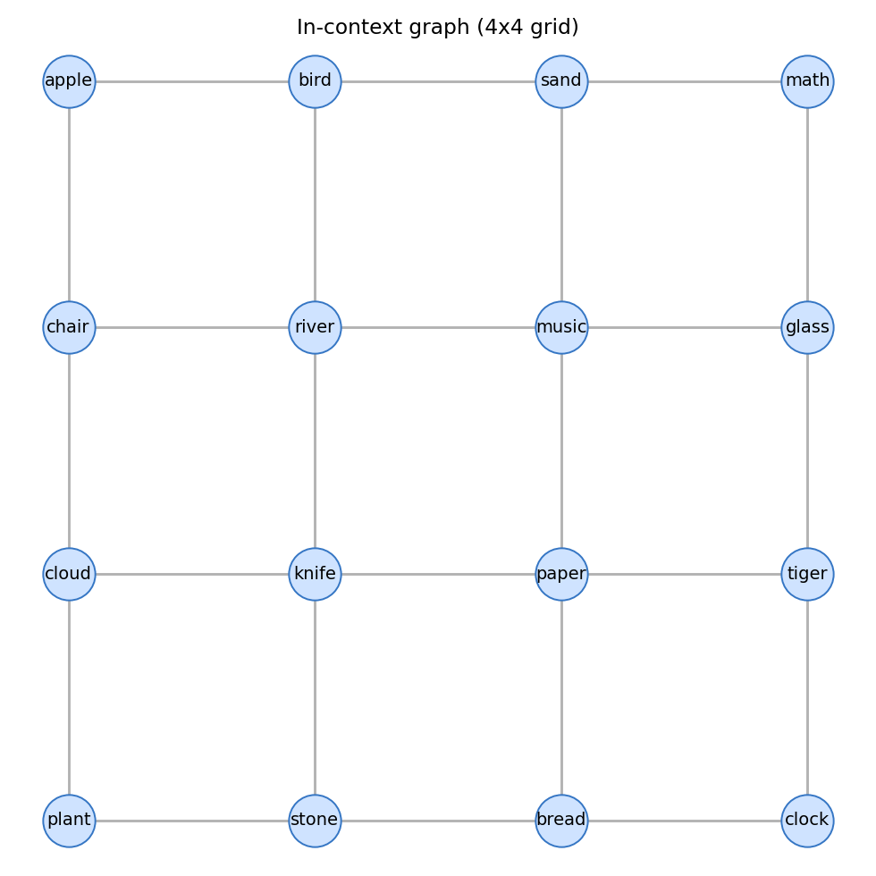
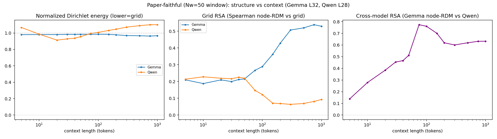
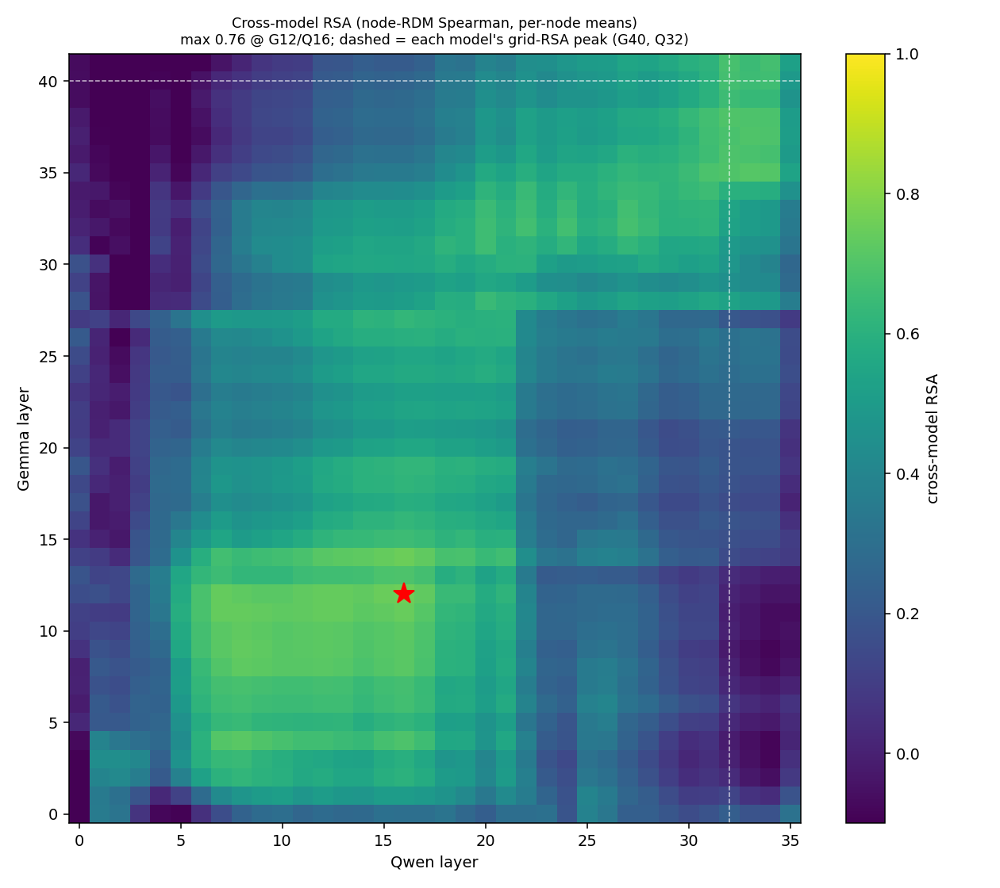
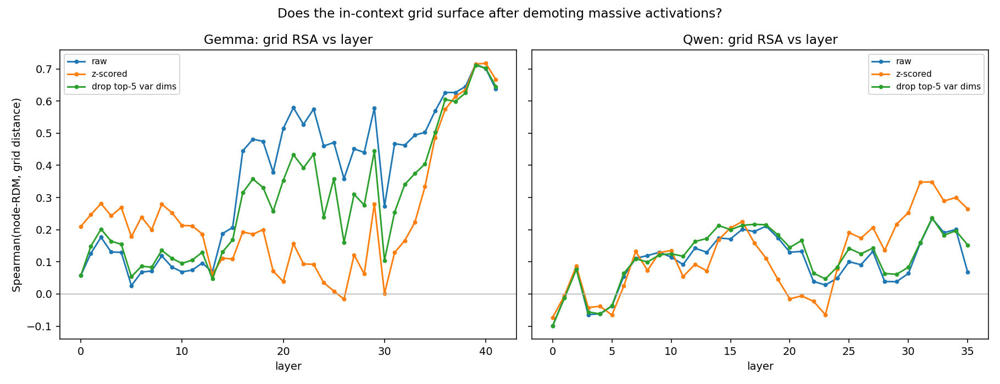
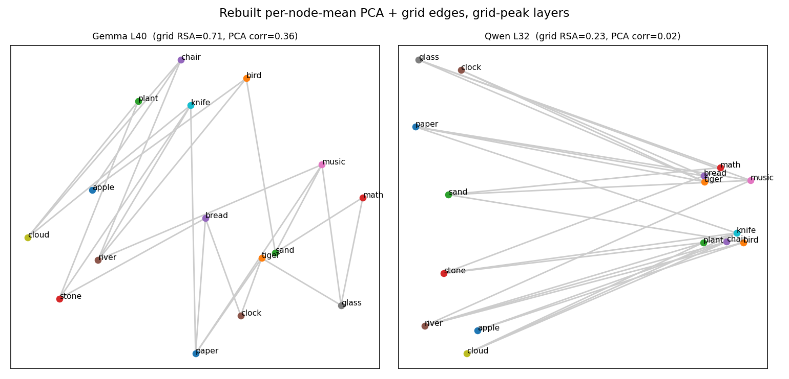

# Cross-Model Alignment of In-Context Graph Representations

Extension of Park, Lee, Lubana et al., *ICLR: In-Context Learning of
Representations* (ICLR 2025). The paper shows that feeding an LLM random walks
over a graph whose nodes are familiar concept words causes its internal
representations to reorganize to match the **graph geometry** rather than the
words' pretrained semantics.

**This extension asks:** do two different models — `meta-llama/Llama-3.1-8B`
and `google/gemma-2-9b` — represent the in-context graph structure the *same
way*? We fit a linear map between their residual-stream activations on
**identical token sequences** and use alignment quality as a measure of
representational similarity.

Only the **plain random walk** condition is built (semantically unrelated words
on the nodes, no competing pretrained prior). The paper's semantic-conflict /
days-of-the-week condition is **not** built yet.

## Key design decisions (confirmed)

- **Tokenizer-alignment rule: LAST subword token.** A concept word may be 1
  token in one model and several in another. We resolve each occurrence to the
  activation at its **final subword token**, applied identically to both models
  (`config.subword_rule`). Resolution uses the fast tokenizer's character
  offset mapping (`models.resolve_token_spans`), so it is robust to
  leading-space merging and BOS tokens. `"first"` and `"mean"` are also
  implemented for ablations.
- **Pairing is by `(walk_id, step)`, never by token position.** Both models run
  on the same word sequences; "context length" of an occurrence is its 1-based
  word step (nodes emitted so far), which is identical across models despite
  tokenizer differences. This is what makes the matched/mismatched-context
  control well-defined.
- **Per-occurrence activations, NOT per-node means.** Every occurrence of every
  word, at every context length, in every walk, is kept as a separate vector
  tagged `(node, layer, context_length, walk_id, step)`. Per-node means are
  computed *only* inside the paper-reproduction sanity check.
- **GPU: single H200 (141GB).** Both 8–9B models could co-reside, but they are
  loaded/run **sequentially** and activations are cached to disk, so alignment
  re-runs offline without re-inference and peak memory stays bounded. Weights in
  bf16; activations cached as fp16.

## Files

| file           | role |
|----------------|------|
| `config.py`    | frozen-dataclass config; `DEFAULT` (H200) and `SMOKE` (CPU) presets; fixed concept-word vocabulary |
| `graph.py`     | grid graph + node-word assignment + uniform random-walk generation; per-occurrence index |
| `models.py`    | model loading + forward-hook residual-stream capture; tokenizer-alignment (offset mapping) |
| `align.py`     | pairing, splits, well-posedness guard, ridge (a) + PCA-Procrustes (b), CKA, trajectory & matched/mismatched control |
| `reproduce.py` | paper-reproduction sanity check: per-node-mean PCA recovers the grid |
| `run.py`       | orchestration: `capture` → `reproduce` → `align` |

## Usage

Both models are **gated** on HuggingFace — accept the licenses and log in first:

```bash
pip install -r requirements.txt
huggingface-cli login
```

```bash
python run.py --preset default --stage all       # full run on the H200
python run.py --preset default --stage capture    # inference only (cache acts)
python run.py --preset default --stage reproduce   # sanity check from cache
python run.py --preset default --stage align       # alignment from cache

python run.py --preset smoke --stage all          # tiny CPU end-to-end test
```

Artifacts land in `runs/<preset>/`: `acts_model_a.npz`, `acts_model_b.npz`,
`walks.json`, `config.json`, `reproduce.json` (+ `grid_recovery_*.png`),
`alignment.json`.

## Analysis outputs (`alignment.json`)

1. **Two maps compared:** (a) ridge regression A→B in full space (rectangular,
   4096→3584); (b) shared top-k PCA subspace + orthogonal Procrustes.
2. **Well-posedness guard:** logs `n_samples` vs map degrees of freedom and
   **warns loudly** if `n_samples` isn't ≫ params. Full-space ridge has
   `d_A·d_B ≈ 14.7M` params and will trip the guard unless you have that many
   occurrences — the PCA-subspace map (`k·(k−1)/2`) is the well-posed one. This
   is by design and is the failure mode to watch.
3. **Metrics:** held-out R² (split **by walk_id**), Procrustes residual, and
   linear **CKA** as a basis-free cross-check.
4. **Trajectory vs endpoint:** the map is fit on activations pooled across all
   context lengths, then alignment is reported **separately at each context
   length** — does one map align the whole in-context trajectory, or only at
   convergence?
5. **Matched vs mismatched context control:** evaluate A@L against B@L (matched)
   vs B@L' (mismatched). If matched isn't better, the alignment tracks static
   geometry, not the in-context process.

## Reproduce-first

`reproduce.py` runs before the alignment work: PCA of per-node-mean activations
at high context should visibly recover the grid (rising distance-correlation
with context length, and a scatter plot). Confirm this before trusting any
alignment number — it tells you activations were captured correctly.

## Memory / scaling notes

- Sequential load → bounded peak memory even on smaller cards; on the H200
  there is ample headroom to raise `n_walks` / `walk_length`.
- Captured layers are a configurable band (`capture_layers_*`) so layer sweeps
  and `reproduce.py` reuse one cache. fp16 activations:
  `n_occurrences × d × 2 bytes × n_layers`.
- Everything is seeded (`config.seed`); raw activations are saved so analysis
  re-runs without re-inference.

## Results

### The in-context graph
The 4×4 grid the walks traverse — semantically unrelated words on the nodes,
edges between orthogonal neighbours.



### In-context emergence (paper-faithful, Nw=50 window + Dirichlet energy)
Structure vs context length, computed the way Park et al. do it (sliding
50-token window, per-node means). **Gemma's grid structure emerges with
context** (grid RSA rises ~0.2 → 0.54, Dirichlet energy falls); **Qwen's does
not at the tested layer** — though that is partly a massive-activation
confound (see below).



### Cross-model similarity (RSA on per-node means, every layer pair)
Rank-correlation of the two models' node-geometries. Unlike the earlier CKA
version (which peaked at the earliest layers — pure surface-token similarity),
this peaks at mid/deep layers; where each model actually encodes the grid
(dashed lines) the geometries align moderately (~0.6–0.7).



### Massive-activation confound and the standardization fix
Qwen's representation is dominated by a single outlier dimension (~94% of
variance at L12). Demoting it (z-score / drop top-var dims) surfaces grid
structure that the raw, variance-dominated metrics missed.



### Grid-peak node maps (per-node-mean PCA)
Each model at its strongest grid layer. Gemma's grid is far cleaner; Qwen's is
weak even at its best (and the 2D PCA understates the full-dimensional RSA).



### Full per-layer slideshows (PDF)
Every layer of both models, side by side, as browseable multi-page PDFs:
- [`pca_per_layer_nodemean.pdf`](runs/gemma_qwen_all/pca_per_layer_nodemean.pdf)
  — **rebuilt**, paper-style: 16 labelled nodes + grid edges per layer (per-node
  means). Page 1 is the graph itself.
- [`pca_per_layer.pdf`](runs/gemma_qwen_all/pca_per_layer.pdf) — original
  per-occurrence version (every word is a cloud of points; kept for contrast).

### Headline
Both models learn the in-context graph **behaviourally** (next-step neighbour
prediction → ~ceiling, see `runs/accuracy/`), but a memoryless in-context
counter matches that, so behavioural accuracy alone is not decisive.
**Representationally**, Gemma builds a clear grid geometry (RSA ≈ 0.7) while
Qwen's is weak and buried under massive activations — the models reach
functionally similar solutions expressed very differently. See `PROCEDURE.md`
for the full method and `runs/` for all metrics.
